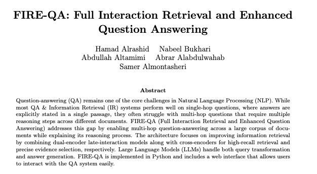
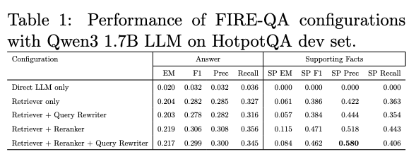
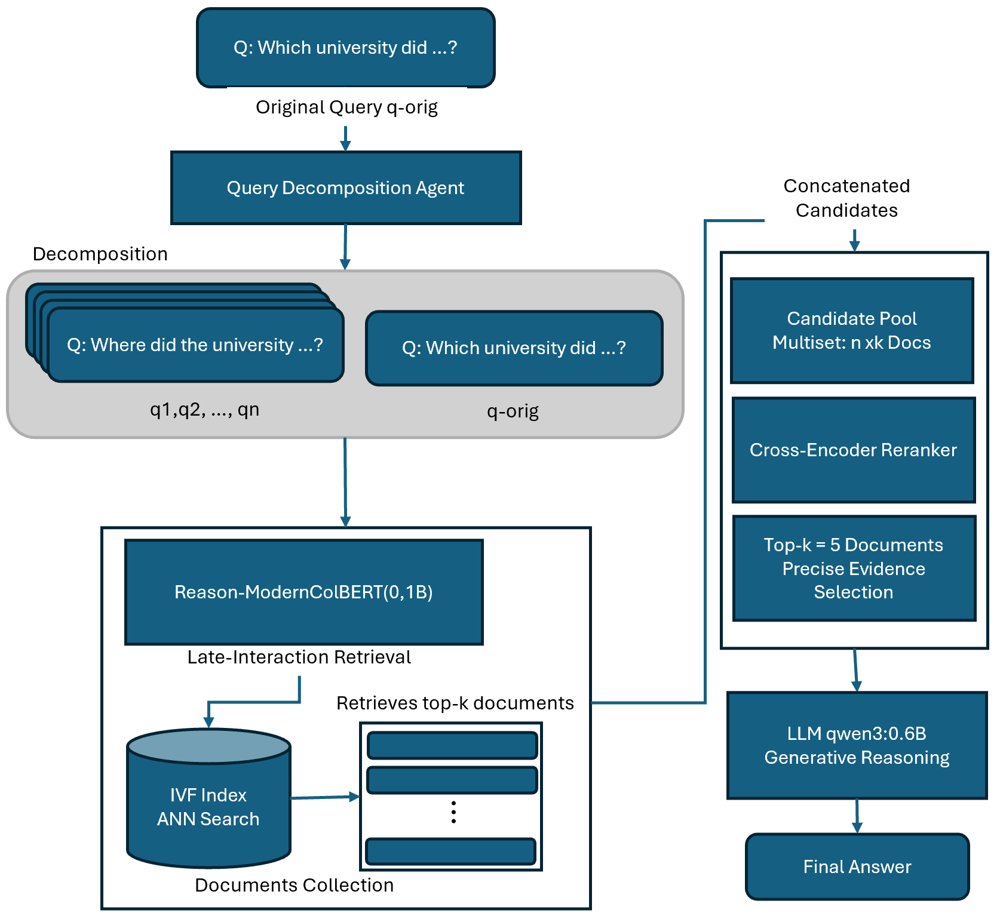

# SDAIA & University of Oxford - Final Project

FIRE-QA (Full Interaction Retrieval and Enhanced Question Answering):

An advanced QA system that performs multi-hop reasoning across multiple documents and explains its reasoning path, targeting the HotpotQA dataset. The core is a novel multi-stage retrieval pipeline that uses query decomposition followed by late-interaction encoders for high-recall retrieval and cross-encoder rerankers for precise evidence selection. This was a three-week project 

## Abstract

## Evaluation

## Design

## Quickstart

1. Create/activate venv:
   - `python3 -m venv venv && source venv/bin/activate`
2. Install deps:
   - `pip install -r requirements.txt`
3. CLI demo:
   - `python -m qa_system.pipeline.qa_pipeline"`

## Notes
### Pylate requires Voyager, which is available on python 3.12 and below:

- macos:
   - brew install python@3.12
   - `python3.12 -m venv venv && source venv/bin/activate`
   - `python --version`
   - `pip install -r requirements.txt`

