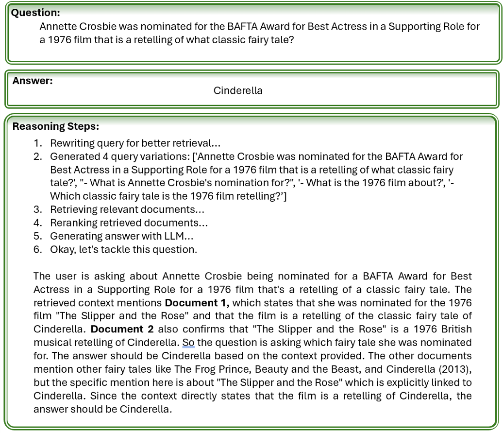

## FIRE-QA (Full Interaction Retrieval and Enhanced Question Answering) 

_SDAIA & University of Oxford Bootcamp - Final Project_

An advanced QA system that performs multi-hop reasoning across multiple documents and explains its reasoning path, targeting the HotpotQA dataset. The core is a novel multi-stage retrieval pipeline that uses query decomposition followed by late-interaction encoders for high-recall retrieval and cross-encoder rerankers for precise evidence selection. This was a three-week project.

The system uses a multi-stage retrieval and reasoning pipeline:
- Query rewriting / decomposition to generate multiple focused sub-queries.
- Late-interaction dense retrieval (ColBERT-style) for high-recall evidence retrieval.
- Cross-encoder reranking for precise evidence selection.
- LLM-based reasoning and answer generation with chain-of-thought style explanation.

---

## Contributors
- Hamad Alrashid  
- Nabeel Bukhari  
- Abdullah Altamimi  
- Abrar Alabdulwahab  
- Samer Almontasheri

---

## Paper
For full technical details, methodology, evaluation, and references, see the project report:

[FIRE-QA: Full Interaction Retrieval & Enhanced Question Answering (PDF)](FIRE_QA_paper.pdf)

---

## Abstract


---

## Design


---

## Example Output

Below is an example of the system answering a multi-hop question. The model not only gives the final answer, but also shows how it got there, including query rewriting, retrieval steps, and an explanation that cites evidence from specific documents.


In this example, the system:  
1. Rewrites the user’s question into several focused variants to improve retrieval.  
2. Retrieves and reranks relevant documents.  
3. Generates an interpretable reasoning chain.  
4. Produces a grounded answer (“Cinderella”).

---

## Evaluation


---

## Project Structure

```
SDAIA-Final-Project/
├── requirements.txt                 # Dependencies
├── README.md                       # Project documentation
├── qa_system/                      # Core QA system package
│   ├── __init__.py
│   ├── data/                       # Data handling & evaluation
│   │   ├── eval.py                 # Evaluation script
│   │   ├── hotpotqa.py             # HotpotQA dataset loader
│   │   └── *.json                  # Dataset files
│   ├── llm/                        # Language model integration
│   │   └── llm.py                  # LLM wrapper
│   ├── pipeline/                   # Main QA pipeline
│   │   └── qa_pipeline.py          # End-to-end QA process
│   ├── query_rewriter/             # Query decomposition
│   │   └── rewriter.py             # Query rewriting logic
│   ├── reranker/                   # Evidence reranking
│   │   └── reranker.py             # Cross-encoder reranker
│   ├── retrieval/                  # Document retrieval
│   │   ├── retriever.py            # ColBERT retriever
│   │   └── index/                  # Pre-built search index
│   ├── ui/                         # Web interface
│   │   └── app.py                  # Gradio app UI
│   └── utils/                      # Utilities
│       └── config.py               # Configuration
└── results-*.json                  # Evaluation results
```

## Quickstart

1. Create/activate venv:
   - `python3 -m venv venv && source venv/bin/activate`
2. Install deps:
   - `pip install -r requirements.txt`
3. CLI demo:
   - `python -m qa_system.pipeline.qa_pipeline"`


## Notes
### Pylate requires Voyager, which is available on python 3.12 and below:

- macos:
   - brew install python@3.12
   - `python3.12 -m venv venv && source venv/bin/activate`
   - `python --version`
   - `pip install -r requirements.txt`


